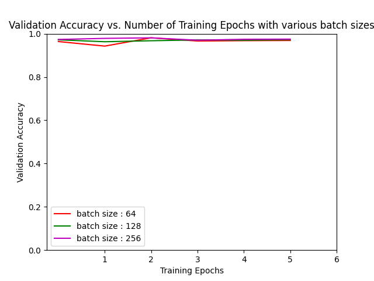
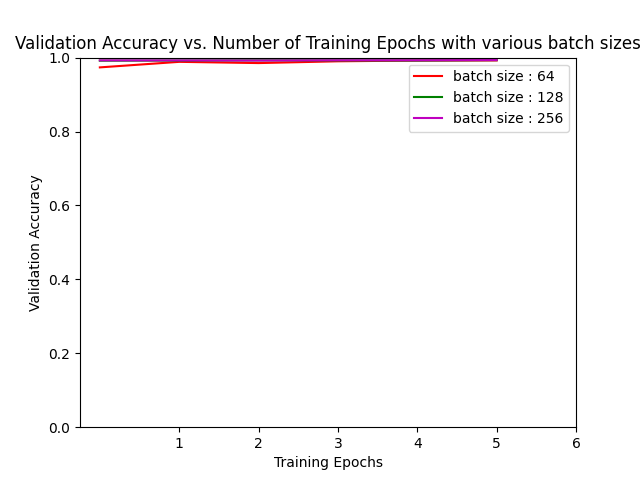

# Hand Gesture Recognition

## Description
Hand gesture recognition is an important way of communicating among humans and also between human and a machine. This has a wide range of applications, from interacting with robots, to interacting with laptops, mobile phones and helping specially abled people to express themselves. 

Our goal in this project is to build and apply various models which recognize hand gestures and use it to make an onscreen real time calculator. The model is trained to recognize 18 classes with each class having 900 training images. 

We have trained the dataset on various standard architectures like VGG, Inception, Resnet, Squeezenet, Alexnet and Densenet and obtained good accuracies above 98% for all the models.

## Process flow

 Model preparation
 
Along with standard architectures as mentioned above we have also deployed a custom CNN model which is optimized for quick prediction during real time implementation. 

Segmenting hand from video sequence

 - Background subtraction

    We take an input sequence of 30 frames at the start to apply running averages and figure the background in the video sequence. After this we introduce the hand in the next frame. This frame contains the foreground and we find the absolute difference between the current frame and the background generated using running averages. This gives us the background subtracted output.

 - Motion detection and thresholding

    We use a threshold parameter on the difference image to filter out only the hand and set all other objects into the background

 - Contour extraction

    We find the contours in the thresholded image and obtain the contour with maximum area as the hand. 

Prediction using model
We apply the model to the segmented images which predicts a probability vector for all the 18 different classes. We then use get the index of the maximum for the output and map them to the labels we need.

## Dataset
The dataset consists of around 21000 images for 18 different gesture classes with each gesture containing around 900 training images and 300 testing images. The images in the dataset are 50 x 50 pixels.

The link for the dataset is as follows:
https://www.kaggle.com/aryarishabh/hand-gesture-recognition-dataset

## What are some of the problems we faced?

The problem we faced was that the datasets we we used were incredibly undersized and in order to use them with sophisticated large models like Inception v3, Densenet,etc the images had to be resized nearly 5 times which although proved good to go while training the implementation on the webcam was challenging. The accuracy obtained could have been better. 

Due to the limited availability of GPU computation resources we had to run the dataset containing 21000 thousand images(although the image was undersized) and  on Google colab and kaggle notebooks and fine tuning the pre-trained models was very challenging.We spent a significant amount of time with the local CUDA crashing while training with the datasets. 

It was really disappointing to realize that the amount of time spent on training the networks did not yield the desired results at runtime.

## Performance analysis

We have trained the above-mentioned models on the vast dataset and obtained good accuracies for each of them as depicted by the plots.

Overall we were able to obtain excellent accuracies for each of the models on the vast datasets we deployed as depicted by the plots. For each model we have trained on batch sizes of  64,128 and 256. 
We suspect that the reason for challenging results at runtime is attributed to the transformations necessary to feed the network into the large models. Although a huge dataset, the lack of diversity between the samples caused the poor generalization of the network.

The model performance are as given below:

A baseline custom CNN architecture

- Inception     

          

- Resnet

-  VGG

- Squeezenet

- Alexnet

- Densenet

